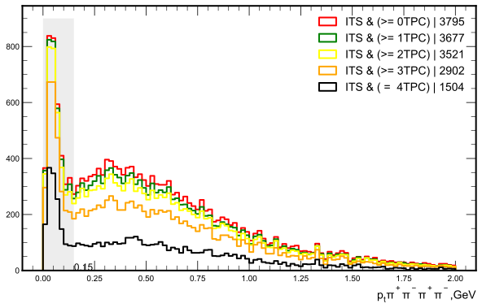
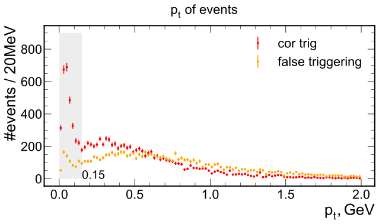
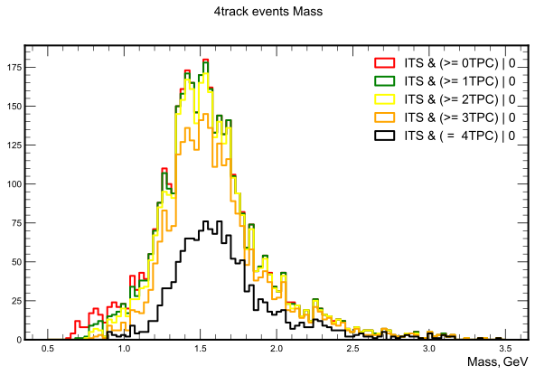
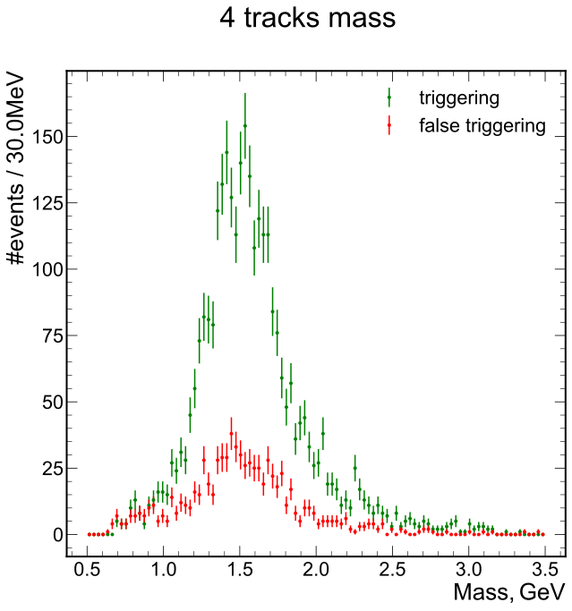
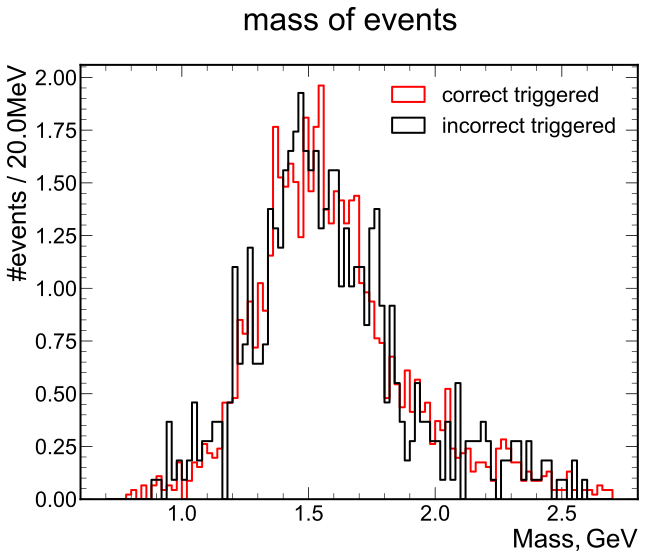
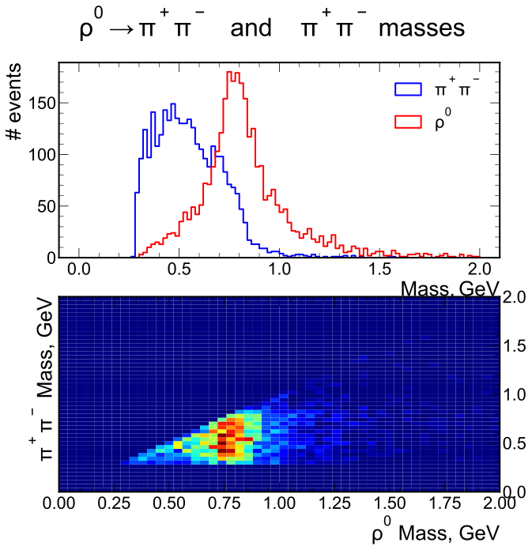
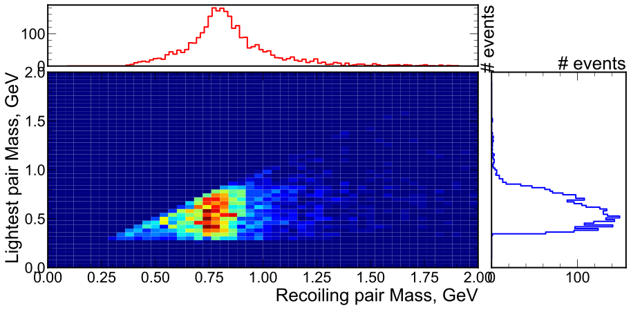
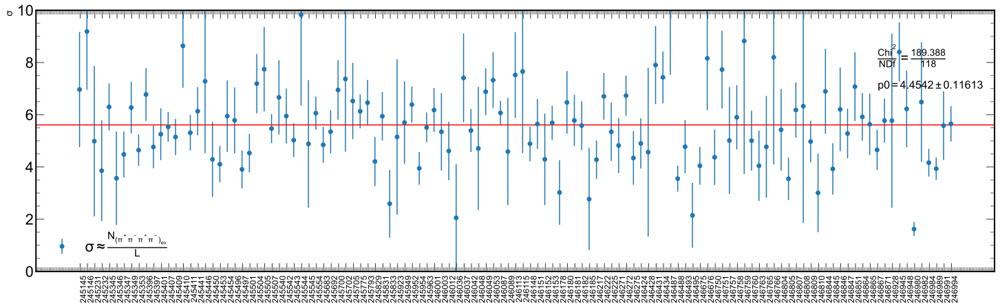

# $\rho'$ analysis notes

## GIRD Selection criteria:

These criteria were applied on the selection stage(GRID):

Events:

- \>= 4 tracks
    
Tracks:

- Has Point On inner OR outer ITS Layer
- Not ITS SA
- |dca1| < 3 && |dca0| < 3;

### Data info

    Events attributes:
    ['RunNum', 'PeriodNumber', 'OrbitNumber', 'BunchCrossNumber', 'Mass', 'Pt', 'Q', 'Rapidity', 'Phi', 'ZNAenergy', 'ZNCenergy', 'ZPAenergy', 'ZPCenergy', 'VtxX', 'VtxY', 'VtxZ', 'VtxContrib', 'VtxChi2', 'VtxNDF', 'SpdVtxX', 'SpdVtxY', 'SpdVtxZ', 'SpdVtxContrib', 'V0Adecision', 'V0Cdecision', 'ADAdecision', 'ADCdecision', 'V0Afired', 'V0Cfired', 'ADAfired', 'ADCfired', 'STPfired', 'SMBfired', 'SM2fired', 'SH1fired', 'OM2fired', 'OMUfired', 'IsTriggered', 'nTracklets', 'nTracks', 'FORChip']
    Track attributes:
    ['T_NumberOfSigmaTPCPion', 'T_Eta', 'T_Phi', 'T_Px', 'T_Py', 'T_Pz', 'T_Q', 'T_HasPointOnITSLayer0', 'T_HasPointOnITSLayer1', 'T_ITSModuleInner', 'T_ITSModuleOuter', 'T_TPCNCls', 'T_TPCRefit']
    
    Events count: 106,705
    Tracks count: 25,117,847
    

## Analysis criteria

Let's take from input date only events with 4 tracks and zero total charge.
Also prepare mask for tracks that satisfy standatd criteria contains further conditions for the TPC:

* |NumberOfSigmaTPCPion| < 3
* Number of TPC Clusters > 50
* TPCRefit
## Low energy tracks and TPC

There is an idea about that tracks with small energies (low pt) not able to reach TPC.
We can try to estimate influence of TPC criteria to the statistics.

Let's see what happend in case of we will plot pt for any combination of TPC tracks:

### Event with std criteria

|detector|track1|track2|track3|track4|
|:--:|:--:|:--:|:--:|:--:|
|ITS|+|+|+|+|
|TPC|+|+|+|+|

### Let's start to take also such combinations to the sample:

|detector|track1|track2|track3|track4|
|:--:|:--:|:--:|:--:|:--:|
|ITS|+|+|+|+|
|TPC|+|+|+|-|

|detector|track1|track2|track3|track4|
|:--:|:--:|:--:|:--:|:--:|
|ITS|+|+|+|+|
|TPC|+|+|-|-|

|detector|track1|track2|track3|track4|
|:--:|:--:|:--:|:--:|:--:|
|ITS|+|+|+|+|
|TPC|+|-|-|-|

|detector|track1|track2|track3|track4|
|:--:|:--:|:--:|:--:|:--:|
|ITS|+|+|+|+|
|TPC|-|-|-|-|

We can see statistics gain ration equal 2.5 between std criteria and total combinations:

## False triggering

There are some situations when CCUP9 trigger could be fired false:
It may occured when some fake or random track fires FOR and trigger will provide.

We can check list of FORs of event and what chipkey has each of four tracks.
In case it has matches and produce back to back topology this means correct trigger state.

See debugging details in [one of the issue](https://github.com/bdrum/cern-physics/issues/42)

      0%|          | 0/76776 [00:00<?, ?it/s]<ipython-input-3-c6feb8d2429e>:36: SettingWithCopyWarning: 
    A value is trying to be set on a copy of a slice from a DataFrame
    
    See the caveats in the documentation: https://pandas.pydata.org/pandas-docs/stable/user_guide/indexing.html#returning-a-view-versus-a-copy
      df.vPhiInner[i] = vPhiInner1
    <ipython-input-3-c6feb8d2429e>:39: SettingWithCopyWarning: 
    A value is trying to be set on a copy of a slice from a DataFrame
    
    See the caveats in the documentation: https://pandas.pydata.org/pandas-docs/stable/user_guide/indexing.html#returning-a-view-versus-a-copy
      df.vPhiOuter[i] = vPhiOuter1
    <ipython-input-3-c6feb8d2429e>:41: SettingWithCopyWarning: 
    A value is trying to be set on a copy of a slice from a DataFrame
    
    See the caveats in the documentation: https://pandas.pydata.org/pandas-docs/stable/user_guide/indexing.html#returning-a-view-versus-a-copy
      df.vPhiInnerValue[i] = vPhiInnerValues
    <ipython-input-3-c6feb8d2429e>:42: SettingWithCopyWarning: 
    A value is trying to be set on a copy of a slice from a DataFrame
    
    See the caveats in the documentation: https://pandas.pydata.org/pandas-docs/stable/user_guide/indexing.html#returning-a-view-versus-a-copy
      df.vPhiOuterValue[i] = vPhiOuterValues
    100%|██████████| 76776/76776 [04:50<00:00, 264.48it/s]
    100%|██████████| 19194/19194 [00:10<00:00, 1816.33it/s]
    

### Trigger share

<table border="1" class="dataframe">
  <thead>
    <tr style="text-align: right;">
      <th></th>
      <th>nTPC</th>
      <th>total_cnt</th>
      <th>trig_cnt</th>
      <th>untrig_cnt</th>
      <th>trig % from ttl</th>
      <th>untrig % from ttl</th>
    </tr>
  </thead>
  <tbody>
    <tr>
      <th>0</th>
      <td>0</td>
      <td>19194</td>
      <td>10349</td>
      <td>8845</td>
      <td>53.9</td>
      <td>46.1</td>
    </tr>
    <tr>
      <th>1</th>
      <td>1</td>
      <td>17641</td>
      <td>10138</td>
      <td>7503</td>
      <td>57.5</td>
      <td>42.5</td>
    </tr>
    <tr>
      <th>2</th>
      <td>2</td>
      <td>16506</td>
      <td>9572</td>
      <td>6934</td>
      <td>58.0</td>
      <td>42.0</td>
    </tr>
    <tr>
      <th>3</th>
      <td>3</td>
      <td>12952</td>
      <td>7583</td>
      <td>5369</td>
      <td>58.5</td>
      <td>41.5</td>
    </tr>
    <tr>
      <th>4</th>
      <td>4</td>
      <td>5916</td>
      <td>3506</td>
      <td>2410</td>
      <td>59.3</td>
      <td>40.7</td>
    </tr>
  </tbody>
</table>

## Transversal momentum distribution

We can see what happend in case of we will make criteria for TPC softer, i.e. not each of four tracks
should be TPC refitted, but only 3 etc.

    Canvas(toolbar=Toolbar(toolitems=[('Home', 'Reset original view', 'home', 'home'), ('Back', 'Back to previous …

    

    

Let' see what exactly gain we have in the same order:

0TPC - 1TPC

...

    Warning in <TCanvas::Constructor>: Deleting canvas with same name: c_sg
    Warning in <TROOT::Append>: Replacing existing TH1: ft_zq_Pt_nTpc[4] (Potential memory leak).
    Warning in <TROOT::Append>: Replacing existing TH1: ft_zq_Pt_nTpc[4] (Potential memory leak).
    Warning in <TROOT::Append>: Replacing existing TH1: ft_nzq_Pt_nTpc[4] (Potential memory leak).
    Warning in <TROOT::Append>: Replacing existing TH1: ft_zq_Pt_nTpc[4] (Potential memory leak).
    Warning in <TROOT::Append>: Replacing existing TH1: ft_nzq_Pt_nTpc[4] (Potential memory leak).
    Warning in <TROOT::Append>: Replacing existing TH1: ft_zq_Pt_nTpc[4] (Potential memory leak).
    Warning in <TROOT::Append>: Replacing existing TH1: ft_nzq_Pt_nTpc[4] (Potential memory leak).
    

Now we can try to estimate what influence has [incorrectness triggering](#False-triggering)

    Canvas(toolbar=Toolbar(toolitems=[('Home', 'Reset original view', 'home', 'home'), ('Back', 'Back to previous …

    

    

    772

Now  let's try to see what tracks we lost from signal area and what contribution they have:

TPC and ITS has different coverage for polar angle:

Perhaps we have tracks that not only can't reach TPC, but also has $\theta$ values that TPC doesn't cover.

Below we can see polar angle distribution for tracks that covers three cases:

1. All tracks from events were reconstructed by ITS and TPC
2. Only ITS tracks from events with only part TPC tracks. Here tracks that not reconstructed by TPC
3. All tracks from events were reconstructed by ITS or TPC

We can see small gaps with for the second case, that allow to speak about correctness of the suggestion, but anyway low energy of tracks is the main reason why TPC can't reconstructed tracks.  

    ---------------------------------------------------------------------------

    NameError                                 Traceback (most recent call last)

    <ipython-input-18-4feb77cac62d> in <module>
    ----> 1 ShowComparison('$\\theta$',[AllTPCTracksTheta, ITSDiffTPCTracksTheta, TotalLowPtTheta], '$^\\circ$', ['ITS&&TPC', 'OnlyITSFromNTPCEvents', 'ITS||TPC'], None, nBins=80, ranges=(25,150))
    

    NameError: name 'ShowComparison' is not defined

## Mass
Let's see on the mass distribution of the events

    Canvas(toolbar=Toolbar(toolitems=[('Home', 'Reset original view', 'home', 'home'), ('Back', 'Back to previous …

    

    

Let's compare masses of events with handle triggering manipulations:

_see False triggering chapter below_

    Canvas(toolbar=Toolbar(toolitems=[('Home', 'Reset original view', 'home', 'home'), ('Back', 'Back to previous …

    

    

Let's normalize this plot:

    Canvas(toolbar=Toolbar(toolitems=[('Home', 'Reset original view', 'home', 'home'), ('Back', 'Back to previous …

    

    

+### Pions subsystems

In our process 4 pions were producted. The most probably intermediate state including two pions and $\rho$ i.e.
$$\rho' \rightarrow \rho \ \pi^+ \pi^- \rightarrow \pi^+ \pi^- \pi^+ \pi^-$$ 

We can see this on distribution of mass that can be obtained as all combinations of pairs from intial four tracks, i.e. only four pairs:

Here we can plot two distirbutions:

1. Make all possible(4) combinations of pairs. Then take lightest and pair that belong to one combination with that. Plot masses of these two pairs.
2. Plot masses of masses from possible combinations.

    Canvas(toolbar=Toolbar(toolitems=[('Home', 'Reset original view', 'home', 'home'), ('Back', 'Back to previous …

    No handles with labels found to put in legend.
    findfont: Font family ['TeX Gyre Heros'] not found. Falling back to DejaVu Sans.
    findfont: Font family ['TeX Gyre Heros'] not found. Falling back to DejaVu Sans.
    findfont: Font family ['TeX Gyre Heros'] not found. Falling back to DejaVu Sans.
    

    

    

As we can see above, for second case (all possible pairs) we've got stronger signal in comparison with light-recoil pair as it made in [STAR work](http://arxiv.org/abs/0912.0604v2). Let's build 2d distirbuition and marginals component separately:

    Canvas(toolbar=Toolbar(toolitems=[('Home', 'Reset original view', 'home', 'home'), ('Back', 'Back to previous …

    No handles with labels found to put in legend.
    

    

    

## Cross section

Let's see to cross section of my events.

For this we should take luminosity of runs.

> Unfortunately file that I have to use for getting luminosity have a reference to special class AliTriggerInfo and moreover it packed into TObjArray, so I can't read it via uproot4. This is the reason why I used pure root again. [Here is the script](https://github.com/bdrum/cern-physics/blob/master/root-cpp/RhoPrime/macro/lumi.C) that I used.

Then let's see how much events do we have in each run.

$$L = \frac{1}{\sigma} \frac{\delta N}{\delta t}$$, this means that 

$$\sigma \approx \frac{N}{L}$$

Cross section of phenomena should be flat and independent from runs. 

Let's check it:

    count    119.000000
    mean       5.611438
    std        1.558305
    min        1.621205
    25%        4.630173
    50%        5.584997
    75%        6.479376
    max       10.036004
    Name: sigma, dtype: float64

    Canvas(toolbar=Toolbar(toolitems=[('Home', 'Reset original view', 'home', 'home'), ('Back', 'Back to previous …

    

    

## Other decays

In PDG I've seen also other interesting modes for $\rho'$:

- 1. $\rho' \rightarrow \eta_0 \rho_0$ | ?
   - 1.1. $\rho_0 \rightarrow 4 \pi$ | $2*10^{-5}\%$
   - 1.2. $\rho_0 \rightarrow \pi^+ \pi^-$ | $10^{-2}\%$
   - 1.3. $\eta_0' \rightarrow  \pi^+ \pi^- \gamma$ | $4\%$
   - 1.4. $\eta_0' \rightarrow  \pi^+ \pi^- \pi^0$ | $23\%$
- 2. $\rho' \rightarrow 4 \pi$ | ?

What about $\rho' \rightarrow \rho_0 \rho_0$ is it possible?

## Decay angle for $\rho_0$

According to [65](https://arxiv.org/pdf/1903.00166.pdf) 

$$cos \theta = \frac{2E_{\pi}}{E_{\rho}-1} 1/ \sqrt{1 - 4\frac{m_{\pi}^2}{m_{\rho}^2}}$$

$$E_{\pi}=\sqrt{m_{\pi}^2+p_{\pi}^2}$$
$$E_{\rho}=\sqrt{m_{\rho}^2+p_{\rho}^2}$$

Very close result from [Landau T2 par.11 exc.2](file:///D:/GoogleDrive/Books/phys/%D0%9B%D0%B0%D0%BD%D0%B4%D0%B0%D1%83,%20%D0%9B%D0%B8%D1%84%D1%88%D0%B8%D1%86%20-%20%D0%A2%D0%B5%D0%BE%D1%80.%20%D1%84%D0%B8%D0%B7%D0%B8%D0%BA%D0%B0/%D0%9B%D0%B0%D0%BD%D0%B4%D0%B0%D1%83%20%D0%9B.%D0%94.,%20%D0%9B%D0%B8%D1%84%D1%88%D0%B8%D1%86%20%D0%95.%D0%9C.%20-%20%D0%A2%D0%B5%D0%BE%D1%80%D0%B5%D1%82%D0%B8%D1%87%D0%B5%D1%81%D0%BA%D0%B0%D1%8F%20%D1%84%D0%B8%D0%B7%D0%B8%D0%BA%D0%B0.%20%D0%A2%D0%BE%D0%BC%2002%20%D0%B8%D0%B7%2010.%20%D0%A2%D0%B5%D0%BE%D1%80%D0%B8%D1%8F%20%D0%BF%D0%BE%D0%BB%D1%8F%20(2003.8.%D0%B8%D0%B7%D0%B4)(T).pdf)

$$\cos \theta = \frac{\sqrt{E^2-|P|E}-M_\rho/2}{\sqrt{M_\rho^2-4m_\pi^2}|P|/E}$$

    entry
    20        0.432236
    42        0.630956
    96        0.782677
    198       1.014306
    200       0.670207
                ...   
    106367    1.163941
    106383    1.260068
    106461    0.911308
    106497    0.889234
    106687    0.899221
    Name: Recoil, Length: 3008, dtype: float32

## $ \downarrow \downarrow \downarrow \downarrow$ DEBUG $ \downarrow \downarrow \downarrow \downarrow$

## $\uparrow$$\uparrow$$\uparrow$$\uparrow$ DEBUG $\uparrow$$\uparrow$$\uparrow$$\uparrow$

