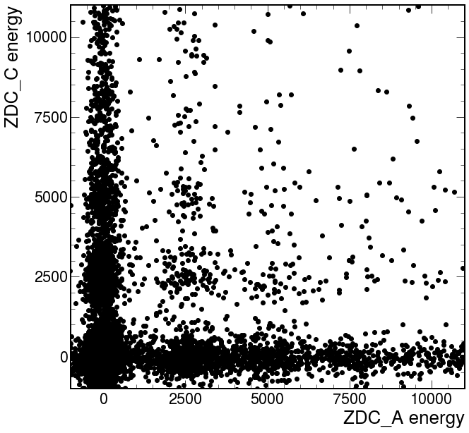
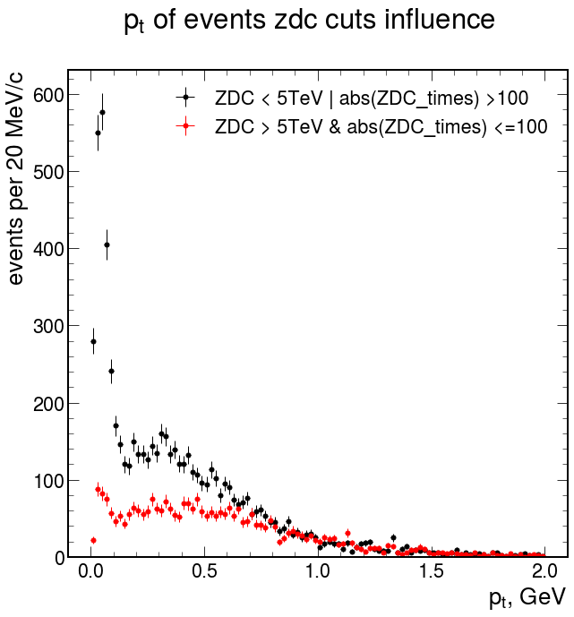

# $\rho'$ analysis notes

## GIRD Selection criteria

These criteria were applied on the selection stage(GRID):

Events:

- \>= 4 tracks
    
Tracks:

- Has Point On inner OR outer ITS Layer
- Not ITS SA
- |dca1| < 3 && |dca0| < 3;

### Data info

    <class 'pandas.core.frame.DataFrame'>
    RangeIndex: 110004 entries, 0 to 110003
    Data columns (total 49 columns):
     #   Column            Non-Null Count   Dtype  
    ---  ------            --------------   -----  
     0   RunNum            110004 non-null  int32  
     1   PeriodNumber      110004 non-null  int64  
     2   OrbitNumber       110004 non-null  int64  
     3   BunchCrossNumber  110004 non-null  int64  
     4   Mass              110004 non-null  float32
     5   Pt                110004 non-null  float32
     6   Q                 110004 non-null  int32  
     7   Rapidity          110004 non-null  float32
     8   Phi               110004 non-null  float32
     9   ZNAenergy         110004 non-null  float32
     10  ZNCenergy         110004 non-null  float32
     11  ZPAenergy         110004 non-null  float32
     12  ZPCenergy         110004 non-null  float32
     13  VtxX              110004 non-null  float32
     14  VtxY              110004 non-null  float32
     15  VtxZ              110004 non-null  float32
     16  VtxContrib        110004 non-null  int32  
     17  VtxChi2           110004 non-null  float32
     18  VtxNDF            110004 non-null  float32
     19  SpdVtxX           110004 non-null  float32
     20  SpdVtxY           110004 non-null  float32
     21  SpdVtxZ           110004 non-null  float32
     22  SpdVtxContrib     110004 non-null  int32  
     23  V0Adecision       110004 non-null  int32  
     24  V0Cdecision       110004 non-null  int32  
     25  ADAdecision       110004 non-null  int32  
     26  ADCdecision       110004 non-null  int32  
     27  V0Afired          110004 non-null  bool   
     28  V0Cfired          110004 non-null  bool   
     29  ADAfired          110004 non-null  bool   
     30  ADCfired          110004 non-null  bool   
     31  STPfired          110004 non-null  bool   
     32  SMBfired          110004 non-null  bool   
     33  SM2fired          110004 non-null  bool   
     34  SH1fired          110004 non-null  bool   
     35  OM2fired          110004 non-null  bool   
     36  OMUfired          110004 non-null  bool   
     37  IsTriggered       110004 non-null  bool   
     38  nTracklets        110004 non-null  int32  
     39  nTracks           110004 non-null  int32  
     40  ZDCAtime_0        110004 non-null  float32
     41  ZDCAtime_1        110004 non-null  float32
     42  ZDCAtime_2        110004 non-null  float32
     43  ZDCAtime_3        110004 non-null  float32
     44  ZDCCtime_0        110004 non-null  float32
     45  ZDCCtime_1        110004 non-null  float32
     46  ZDCCtime_2        110004 non-null  float32
     47  ZDCCtime_3        110004 non-null  float32
     48  FORChip           110004 non-null  object 
    dtypes: bool(11), float32(24), int32(10), int64(3), object(1)
    memory usage: 18.8+ MB
    <class 'pandas.core.frame.DataFrame'>
    MultiIndex: 26978093 entries, (0, 0) to (110003, 3)
    Data columns (total 13 columns):
     #   Column                  Dtype  
    ---  ------                  -----  
     0   T_NumberOfSigmaTPCPion  float32
     1   T_Eta                   float32
     2   T_Phi                   float32
     3   T_Px                    float32
     4   T_Py                    float32
     5   T_Pz                    float32
     6   T_Q                     int32  
     7   T_HasPointOnITSLayer0   bool   
     8   T_HasPointOnITSLayer1   bool   
     9   T_ITSModuleInner        int32  
     10  T_ITSModuleOuter        int32  
     11  T_TPCNCls               int32  
     12  T_TPCRefit              bool   
    dtypes: bool(3), float32(6), int32(4)
    memory usage: 1.2 GB
    

## Transverse momenta of initial data set

<table border="1" class="dataframe">
  <thead>
    <tr style="text-align: right;">
      <th></th>
      <th>count</th>
      <th>mean</th>
      <th>std</th>
      <th>min</th>
      <th>25%</th>
      <th>50%</th>
      <th>75%</th>
      <th>max</th>
    </tr>
  </thead>
  <tbody>
    <tr>
      <th>4tr_zq</th>
      <td>19456.0</td>
      <td>0.837667</td>
      <td>12.995872</td>
      <td>0.000275</td>
      <td>0.215188</td>
      <td>0.483686</td>
      <td>0.846086</td>
      <td>1726.771484</td>
    </tr>
    <tr>
      <th>4tr_nzq</th>
      <td>13762.0</td>
      <td>1.163582</td>
      <td>12.508871</td>
      <td>0.010555</td>
      <td>0.386721</td>
      <td>0.648763</td>
      <td>1.049536</td>
      <td>1328.583740</td>
    </tr>
  </tbody>
</table>

    

    

    C:\Users\bdrum\AppData\Roaming\Python\Python39\site-packages\mplhep\plot.py:238: RuntimeWarning: invalid value encountered in sqrt
      _yerr = np.sqrt(h)
    

    Text(0, 1, '#events / 20MeV')

    

    

## Analysis cuts

### Global tracks

It's known that global tracks consist from ITS and TPC identification, in our case we can implicitly add checks for TPC identification track and see what happens with the data.

Let's aply further conditions for the tracks:

* |NumberOfSigmaTPCPion| < 3
* Number of TPC Clusters > 50
* TPCRefit

## Low energy tracks and TPC

There is an idea about that tracks with small energies (low pt) not able to reach TPC.
Idea is that addding such condition will decrease our signal and background level.

    

    

As we can see above adding of gobal tracks will decrease statistics level, but it is correct for both signal and background. Let's estimate what number of global tracks in 4 tracks is enough:

    

    

Here we see such construction each row contains three plots:
 - starting point or what we have (first cell correspond our initial plot at the very begining of this notebook)
 - what we will throw
 - the difference between 1 and 2

 As we can see in case of transition from zero global tracks to one we will lose only background.
 I guess it's easy to see that the best case when we throw almost only background event is more than 2 global tracks in event.

 In further analysis I will be use this case. 'ITS & (>= 2TPC)'

## False triggering

There are some situations when CCUP9 trigger could be fired false:
It may occured when some fake or random track fires FOR and trigger will provide.

We can check list of FORs of event and what chipkey has each of four tracks.
In case it has matches and produce back to back topology this means correct trigger state.

See debugging details in [one of the issue](https://github.com/bdrum/cern-physics/issues/42)

Let's do the same thing as we do few cell above and let's try to understand what we will throw after splitting event by fake triggered or not:

    

    

Let's see how looks masses for correct and fake trigger events:

    

    

As we can see above the shape of masses for fake trigger and correct trigger the same. Here we use pdf view for a normalization purposes. Despite of this fact we saw on $p_t$ distribution that fake triggers contains signal part, but most of the fake trigger data is bacgrkound events.

In further analysis we will use only correct trigger events. Also we hope that it will make our data closer to MC quality.

## ZDC cuts

ZDC again allows us to make signal more clear. Neutrons in ZDC could be a markers about peripheral events. 

    No handles with labels found to put in legend.
    

    

    

Beside energy distirbution we also have to make corrections for ZDC timing:

    No handles with labels found to put in legend.
    

    

    

Event called passed ZDC cuts if satisfied such criteria:
- For only one of the two sides
- neutrons energy less or equal than given parameter ZDC_En value
- or
- one of ZDC times not in an interval of +- ZDC_Time_Delta parameter value 

<table border="1" class="dataframe">
  <thead>
    <tr style="text-align: right;">
      <th></th>
      <th>count</th>
      <th>mean</th>
      <th>std</th>
      <th>min</th>
      <th>25%</th>
      <th>50%</th>
      <th>75%</th>
      <th>max</th>
    </tr>
  </thead>
  <tbody>
    <tr>
      <th>ZDC &lt; 5TeV | abs(ZDC_times) &gt;100</th>
      <td>6605.0</td>
      <td>0.408039</td>
      <td>2.210536</td>
      <td>0.000275</td>
      <td>0.071012</td>
      <td>0.281112</td>
      <td>0.548197</td>
      <td>176.975204</td>
    </tr>
    <tr>
      <th>ZDC &gt; 5TeV &amp; abs(ZDC_times) &lt;=100</th>
      <td>3032.0</td>
      <td>0.596154</td>
      <td>0.887427</td>
      <td>0.002845</td>
      <td>0.259760</td>
      <td>0.495125</td>
      <td>0.785955</td>
      <td>42.316540</td>
    </tr>
  </tbody>
</table>

    

    

## Transversal momentum distribution after all cuts

<table border="1" class="dataframe">
  <thead>
    <tr style="text-align: right;">
      <th></th>
      <th>count</th>
      <th>mean</th>
      <th>std</th>
      <th>min</th>
      <th>25%</th>
      <th>50%</th>
      <th>75%</th>
      <th>max</th>
    </tr>
  </thead>
  <tbody>
    <tr>
      <th>orig $p_t$</th>
      <td>19456.0</td>
      <td>0.837667</td>
      <td>12.995872</td>
      <td>0.000275</td>
      <td>0.215188</td>
      <td>0.483686</td>
      <td>0.846086</td>
      <td>1726.771484</td>
    </tr>
    <tr>
      <th>$p_t$ all cuts</th>
      <td>6605.0</td>
      <td>0.408039</td>
      <td>2.210536</td>
      <td>0.000275</td>
      <td>0.071012</td>
      <td>0.281112</td>
      <td>0.548197</td>
      <td>176.975204</td>
    </tr>
  </tbody>
</table>

    

    

Now  let's try to see what tracks we lost from signal area and what contribution they have:

TPC and ITS has different coverage for polar angle:

Perhaps we have tracks that not only can't reach TPC, but also has $\theta$ values that TPC doesn't cover.

Below we can see polar angle distribution for tracks that covers three cases:

1. All tracks from events were reconstructed by ITS and TPC
2. Only ITS tracks from events with only part TPC tracks. Here tracks that not reconstructed by TPC
3. All tracks from events were reconstructed by ITS or TPC

We can see small gaps with for the second case, that allow to speak about correctness of the suggestion, but anyway low energy of tracks is the main reason why TPC can't reconstructed tracks.  

## Mass
Let's see on the mass distribution of the events

<table border="1" class="dataframe">
  <thead>
    <tr style="text-align: right;">
      <th></th>
      <th>count</th>
      <th>mean</th>
      <th>std</th>
      <th>min</th>
      <th>25%</th>
      <th>50%</th>
      <th>75%</th>
      <th>max</th>
    </tr>
  </thead>
  <tbody>
    <tr>
      <th>ft_zq_all_cuts</th>
      <td>2418.0</td>
      <td>1.613113</td>
      <td>0.390436</td>
      <td>0.740946</td>
      <td>1.383315</td>
      <td>1.549550</td>
      <td>1.747386</td>
      <td>4.907002</td>
    </tr>
    <tr>
      <th>ft_nzq_pt_cut</th>
      <td>663.0</td>
      <td>1.413462</td>
      <td>0.563853</td>
      <td>0.637530</td>
      <td>0.978157</td>
      <td>1.344274</td>
      <td>1.708745</td>
      <td>4.250375</td>
    </tr>
  </tbody>
</table>

    

    

### Pions subsystems

In our process 4 pions were producted. The most probably intermediate state including two pions and $\rho$ i.e.
$$\rho' \rightarrow \rho \ \pi^+ \pi^- \rightarrow \pi^+ \pi^- \pi^+ \pi^-$$ 

We can see this on distribution of mass that can be obtained as all combinations of pairs from intial four tracks, i.e. only four pairs:

Here we can plot two distirbutions:

1. Make all possible(4) combinations of pairs. Then take lightest and pair that belong to one combination with that. Plot masses of these two pairs.
2. Plot masses of masses from possible combinations.

<table border="1" class="dataframe">
  <thead>
    <tr style="text-align: right;">
      <th></th>
      <th>count</th>
      <th>mean</th>
      <th>std</th>
      <th>min</th>
      <th>25%</th>
      <th>50%</th>
      <th>75%</th>
      <th>max</th>
    </tr>
  </thead>
  <tbody>
    <tr>
      <th>heavy</th>
      <td>4836.0</td>
      <td>0.812236</td>
      <td>0.259066</td>
      <td>0.291725</td>
      <td>0.674686</td>
      <td>0.778129</td>
      <td>0.902377</td>
      <td>3.544038</td>
    </tr>
    <tr>
      <th>light</th>
      <td>4836.0</td>
      <td>0.525252</td>
      <td>0.164924</td>
      <td>0.279545</td>
      <td>0.399250</td>
      <td>0.498259</td>
      <td>0.627641</td>
      <td>2.129988</td>
    </tr>
  </tbody>
</table>

    

    

As we can see above, for second case (all possible pairs) we've got stronger signal in comparison with light-recoil pair as it made in [STAR work](http://arxiv.org/abs/0912.0604v2). Let's build 2d distirbuition and marginals component separately:

    No handles with labels found to put in legend.
    

    

    

## Data modeling
First of all let's try to fit $\rho(0)$ that we can see as heavy pair of final 4 pions state:

    

    

    D:\GoogleDrive\Job\cern\Alice\analysis\dev\physics\notebooks\FourTracks\analysis\fit.py:24: RuntimeWarning: invalid value encountered in sqrt
      q = np.sqrt((x ** 2) / 4 - pi_pl_mass ** 2)
    D:\GoogleDrive\Job\cern\Alice\analysis\dev\physics\notebooks\FourTracks\analysis\fit.py:24: RuntimeWarning: invalid value encountered in sqrt
      q = np.sqrt((x ** 2) / 4 - pi_pl_mass ** 2)
    

    [[Model]]
        (Model(bw_bckg, prefix='bw_') + Model(polynomial, prefix='bckg_'))
    [[Fit Statistics]]
        # fitting method   = leastsq
        # function evals   = 30
        # data points      = 98
        # variables        = 9
        chi-square         = 6005.22121
        reduced chi-square = 67.4743956
        Akaike info crit   = 421.310875
        Bayesian info crit = 444.575582
    ##  Warning: uncertainties could not be estimated:
        bw_G:         at initial value
        bw_amp:       at initial value
        bckg_c0:      at initial value
        bckg_c1:      at initial value
        bckg_c3:      at initial value
        bckg_c4:      at initial value
        bckg_c5:      at initial value
    [[Variables]]
        bw_M:         0.76755874 (init = 0.77)
        bw_G:         0.15000000 (init = 0.15)
        bw_amp:       165.000000 (init = 165)
        bw_amp_bckg:  0 (fixed)
        bckg_c0:     -138.848812 (init = -138.8488)
        bckg_c1:      739.990410 (init = 739.9904)
        bckg_c2:     -748.736499 (init = -748.6897)
        bckg_c3:     -75.0224404 (init = -75.02244)
        bckg_c4:      358.446762 (init = 358.4468)
        bckg_c5:     -111.293216 (init = -111.2932)
    

    

    

    [[Model]]
        (Model(bw_bckg, prefix='bw_') + Model(polynomial, prefix='bckg_'))
    [[Fit Statistics]]
        # fitting method   = leastsq
        # function evals   = 30
        # data points      = 65
        # variables        = 9
        chi-square         = 9415.11713
        reduced chi-square = 168.127092
        Akaike info crit   = 341.419500
        Bayesian info crit = 360.988985
    ##  Warning: uncertainties could not be estimated:
        bw_G:         at initial value
        bw_amp:       at initial value
        bckg_c0:      at initial value
        bckg_c1:      at initial value
        bckg_c2:      at initial value
        bckg_c4:      at initial value
        bckg_c5:      at initial value
    [[Variables]]
        bw_M:         1.53480217 (init = 1.55)
        bw_G:         0.40000000 (init = 0.4)
        bw_amp:       110.000000 (init = 110)
        bw_amp_bckg:  0 (fixed)
        bckg_c0:     -140.522813 (init = -140.5228)
        bckg_c1:      545.656453 (init = 545.6565)
        bckg_c2:     -750.360538 (init = -750.3605)
        bckg_c3:      509.493396 (init = 509.5222)
        bckg_c4:     -171.189120 (init = -171.1891)
        bckg_c5:      22.4927273 (init = 22.49273)
    

    

    

    [[Model]]
        ((Model(bw_bckg, prefix='bw1_') + Model(bw_bckg, prefix='bw2_')) + Model(polynomial, prefix='bckg_'))
    [[Fit Statistics]]
        # fitting method   = leastsq
        # function evals   = 65
        # data points      = 65
        # variables        = 12
        chi-square         = 7381.36207
        reduced chi-square = 139.270982
        Akaike info crit   = 331.601203
        Bayesian info crit = 357.693850
    ##  Warning: uncertainties could not be estimated:
        bw1_M:         at initial value
        bw1_G:         at initial value
        bw1_amp:       at initial value
        bw2_M:         at initial value
        bw2_G:         at initial value
        bw2_amp:       at initial value
        bckg_c0:       at initial value
        bckg_c1:       at initial value
        bckg_c2:       at initial value
        bckg_c4:       at initial value
        bckg_c5:       at initial value
    [[Variables]]
        bw1_M:         1.45000000 (init = 1.45)
        bw1_G:         0.30000000 (init = 0.3)
        bw1_amp:       90.0000000 (init = 90)
        bw1_amp_bckg:  0 (fixed)
        bw2_M:         1.70000000 (init = 1.7)
        bw2_G:         0.40000000 (init = 0.4)
        bw2_amp:       40.0000000 (init = 40)
        bw2_amp_bckg:  0 (fixed)
        bckg_c0:      -140.522813 (init = -140.5228)
        bckg_c1:       545.656453 (init = 545.6565)
        bckg_c2:      -750.360538 (init = -750.3605)
        bckg_c3:       509.359668 (init = 509.5222)
        bckg_c4:      -171.189120 (init = -171.1891)
        bckg_c5:       22.4927273 (init = 22.49273)
    

    <matplotlib.legend.Legend at 0x2092dbba2e0>

    

    

## Decay angle for $\rho_0$

Here we would like to study angle decay for $\rho_0 \rightarrow \pi^+\pi^-$ between the momentum of one of the pions in the rest frame of $\rho_0$ and original(lab frame) momentum of  $\rho_0$.

For the sake of simplicity first we will create new lab system with OZ axis directed along momentum of $\rho_0$ in lab frame.

The transition from original lab frame to the new one could be obtain by two rotation:

- First, around x axis:

Rotation matrix for this case:
$$
R_{x,\alpha}=
\Bigg(
\begin{matrix}
1 & 0 & 0\\
0 & \cos{\alpha} & -\sin{\alpha} \\
0 & \sin{\alpha} & \cos{\alpha}
\end{matrix}
\Bigg)
$$

Rotation angle for x axis:

$$
\begin{matrix}
\sin{\alpha} =  \frac{p_y}{\sqrt{p_y^2+p_z^2}}  \\
\cos{\alpha} =  \frac{p_z}{\sqrt{p_y^2+p_z^2}}  \\
\end{matrix}
$$

Now, momentum vector of $\rho_0$ in this system will looks like

$$
\boldsymbol{p'}=R_{x,\alpha}\boldsymbol{p}=
\Bigg(
\begin{matrix}
p_x\\
p_y\cos{\alpha} - p_z\sin{\alpha}\\
p_y\sin{\alpha} + p_z\cos{\alpha})
\end{matrix}
\Bigg)
$$

- Second, around y axis:

Rotation matrix for this case will looks like
$$
R = R_{y,-\beta}= 
\Bigg(
\begin{matrix}
\cos{\beta} & 0 & -\sin{\beta}\\
0 & 1 & 0 \\
\sin{\beta} & 0 & \cos{\beta}
\end{matrix}
\Bigg)
$$

We have to apply it for already rotated vector around x axis:

$$
\boldsymbol{p''} =R_{y,-\beta}\boldsymbol{p'} = 
\Bigg(
\begin{matrix}
\cos{\beta} & 0 & -\sin{\beta}\\
0 & 1 & 0 \\
\sin{\beta} & 0 & \cos{\beta}
\end{matrix}
\Bigg)
\Bigg(
\begin{matrix}
{p'}_x\\
{p'}_y\\
{p'}_z
\end{matrix}
\Bigg)
 = 
\Bigg(
\begin{matrix}
{p'}_x\cos{\beta}-{p'}_z\sin{\beta}\\
{p'}_y\\
{p'}_x\sin{\beta}+{p'}_z\cos{\beta}
\end{matrix}
\Bigg)
$$

Where rotation angle based on the new rotated vector $\boldsymbol{p'}$ coordinates:

$$
\begin{matrix}
\sin{\beta}  =  \frac{{p'}_x}{\sqrt{{p'_x}^2+{p'}_z^2}}  \\
\cos{\beta}  =  \frac{{p'}_z}{\sqrt{{p'_x}^2+{p'}_z^2}}  \\
\end{matrix}
$$

As a result final transition looks like:
_____________
$$
\boldsymbol{p''} =
\Bigg(
\begin{matrix}
{p'}_x\cos{\beta}-{p'}_z\sin{\beta}\\
{p'}_y\\
{p'}_x\sin{\beta}+{p'}_z\cos{\beta}
\end{matrix}
\Bigg)=
\Bigg(
\begin{matrix}
p_x\cos{\beta}-p_y\sin{\alpha}\sin{\beta}-p_z\cos{\alpha}\sin{\beta} \\
p_y\cos{\alpha}-p_z\sin{\alpha} \\
p_x\sin{\beta}+p_y\sin{\alpha}\cos{\beta}+p_z\cos{\alpha}\cos{\beta}
\end{matrix}
\Bigg)
$$
where rotation angles are:

$$
\begin{matrix}
\sin{\alpha} =  \frac{p_y}{\sqrt{p_y^2+p_z^2}}  \\
\cos{\alpha} =  \frac{p_z}{\sqrt{p_y^2+p_z^2}}  \\
\sin{\beta}  =  \frac{p_x}{\sqrt{p_x^2+(p_y\sin{\alpha}+p_z\cos{\alpha})^2}}  \\
\cos{\beta}  =  \frac{p_y\sin{\alpha}+p_z\cos{\alpha}}{\sqrt{p_x^2+(p_y\sin{\alpha}+p_z\cos{\alpha})^2}}  \\
\end{matrix}
$$

Now let's consider moving coordinate system with $\rho_0$ so that OZ axis direct along $\boldsymbol{p}_{\rho_0}$

We know components of original momentum of $\pi^+$ in the such system and now let's boost their via Lorentz Transormation:

$$
\begin{matrix}
\ {E'} =  \gamma E - \Gamma p_z \\
\ {p'}_x= p_x \\
\ {p'}_y= p_y \\
\ {p'}_z= \gamma p_z - \Gamma E \\
\end{matrix}
$$

where 
$$ \boldsymbol{\beta} = \frac{\boldsymbol{p}}{E} $$
$$ \gamma = \frac{E}{m}$$
$$ \Gamma = \gamma \beta = \frac{p}{m}$$

$$ \boldsymbol{\beta} = \frac{\boldsymbol{p}}{E} $$
$$ \gamma = \frac{1}{\sqrt{1-\frac{p^2}{E^2}}}$$

Now the searched angle can be obtain from scalar multiplication of $\pi^+$ momentum in the rest frame of $\rho_0$ and momentum of $\rho_0$ in the lab frame:

$$\cos{\theta}=\frac{\boldsymbol{{p'}_{\pi^+}}\boldsymbol{p_{\rho_0}}} {{p'}_{\pi^+}p_{\rho_0}}$$

## Cross section

Let's see to cross section of my events.

For this we should take luminosity of runs.

> Unfortunately file that I have to use for getting luminosity have a reference to special class AliTriggerInfo and moreover it packed into TObjArray, so I can't read it via uproot4. This is the reason why I used pure root again. [Here is the script](https://github.com/bdrum/cern-physics/blob/master/root-cpp/RhoPrime/macro/lumi.C) that I used.

Then let's see how much events do we have in each run.

$$L = \frac{1}{\sigma} \frac{\delta N}{\delta t}$$, this means that 

$$\sigma \approx \frac{N}{L}$$

Cross section of phenomena should be flat and independent from runs. 

Let's check it:

    count    117.000000
    mean       3.555185
    std        1.101315
    min        0.716081
    25%        2.823498
    50%        3.477399
    75%        4.276723
    max        6.551968
    Name: sigma, dtype: float64

    

    

## Other decays

In PDG I've seen also other interesting modes for $\rho'$:

- 1. $\rho' \rightarrow \eta_0 \rho_0$ | ?
   - 1.1. $\rho_0 \rightarrow 4 \pi$ | $2*10^{-5}\%$
   - 1.2. $\rho_0 \rightarrow \pi^+ \pi^-$ | $10^{-2}\%$
   - 1.3. $\eta_0' \rightarrow  \pi^+ \pi^- \gamma$ | $4\%$
   - 1.4. $\eta_0' \rightarrow  \pi^+ \pi^- \pi^0$ | $23\%$
- 2. $\rho' \rightarrow 4 \pi$ | ?

What if $\rho' \rightarrow \rho_0 \rho_0$ possible?
